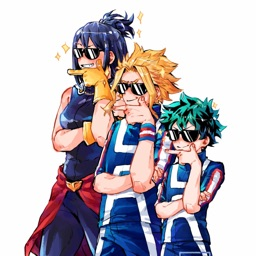

<head>
    <!-- Bootstrap CSS -->
    <link rel="stylesheet" href="https://maxcdn.bootstrapcdn.com/bootstrap/4.0.0/css/bootstrap.min.css"
        integrity="sha384-Gn5384xqQ1aoWXA+058RXPxPg6fy4IWvTNh0E263XmFcJlSAwiGgFAW/dAiS6JXm" crossorigin="anonymous">
</head>

  

  

    

      
      

        <h5 class="card-title">Binod | Owner</h5>
        
Content here

      

    

  

  

    

      
      

        <h5 class="card-title">Acnologia | Head Admin</h5>
        
Content here

      

    

  

  

    

      
      

        <h5 class="card-title">Monisa | Admin</h5>
        
Content here

      

    

  

  

    

      
      

        <h5 class="card-title">Icey | Admin</h5>
        
Content here

      

    

  

  

    

      
      

        <h5 class="card-title">Ranger | Community Manager</h5>
        
Content here

      

    

  

  

    

      
      

        <h5 class="card-title">Pigeon | Head Mod</h5>
        
Content here

      

    

  

  

    

      
      

        <h5 class="card-title">Ragesnow | Moderator</h5>
        
Content here

      

    

  

  

    

      
      

        <h5 class="card-title">Hrutika | Moderator</h5>
        
Content here

      

    

  

  

    

      
      

        <h5 class="card-title">Ash | Trial Moderator</h5>
        
Content here

      

    

  

  

    

      
      

        <h5 class="card-title">Dango | Trial Moderator</h5>
        
Content here

      

    

  

  

    

      
      

        <h5 class="card-title">Saori | Trial Moderator </h5>
        
Content here

      

    

  

  

    

      
      

        <h5 class="card-title">Litzie | Trial Moderator</h5>
        
Content here

      

    

  

